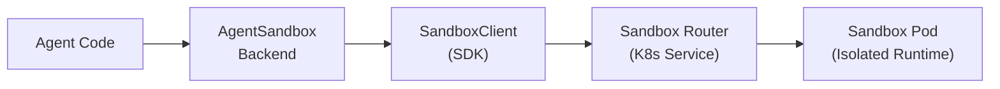

# LangChain Agent Sandbox Backend

A LangChain DeepAgents backend that connects to Kubernetes-native sandbox runtimes via the agent-sandbox Python SDK. Provides secure, isolated execution environments for AI agents with full filesystem virtualization, session reattach, and drain-safe lifecycle management.

## Architecture



Connection mode (tunnel, gateway, direct) is configured on the `SandboxClient` -- the adapter does not expose transport details:

| Mode | When to Use | SandboxClient Config |
|------|-------------|---------------------|
| **Tunnel** | Local development, CI | `SandboxLocalTunnelConnectionConfig()` |
| **Gateway** | Cloud deployments | `SandboxGatewayConnectionConfig(gateway_name=...)` |
| **Direct** | In-cluster, custom domains | `SandboxDirectConnectionConfig(api_url=...)` |

## Installation

```sh
pip install "git+https://github.com/kubernetes-sigs/agent-sandbox.git@main#subdirectory=clients/python/langchain-agent-sandbox"
pip install "git+https://github.com/kubernetes-sigs/agent-sandbox.git@main#subdirectory=clients/python/agentic-sandbox-client"
```

**Requirements:** Python 3.11+, `k8s-agent-sandbox`, `deepagents>=0.5.0`, Kubernetes cluster with agent-sandbox controller, `kubectl`.

## Quickstart

### From existing sandbox (unmanaged)

```python
from k8s_agent_sandbox import SandboxClient
from langchain_agent_sandbox import AgentSandboxBackend

client = SandboxClient()
sandbox = client.create_sandbox(template="my-template")

backend = AgentSandboxBackend.from_existing(sandbox, root_dir="/app")
result = backend.execute("echo hello")
# Caller manages lifecycle: client.delete_sandbox(sandbox.claim_name)
```

### From template (managed lifecycle)

```python
from k8s_agent_sandbox import SandboxClient
from deepagents import create_deep_agent
from langchain_agent_sandbox import AgentSandboxBackend

client = SandboxClient()  # tunnel mode by default

with AgentSandboxBackend.from_template(
    client,
    template_name="python-sandbox",
    namespace="default",
) as backend:
    agent = create_deep_agent(backend=backend)
    result = agent.invoke("Create a hello world script")
```

### Session reattach (multi-turn agents)

```python
from k8s_agent_sandbox import SandboxClient
from langchain_agent_sandbox import AgentSandboxBackend

client = SandboxClient()

# First invocation: creates a new sandbox with session label
with AgentSandboxBackend.from_template(
    client,
    template_name="python-sandbox",
    session_id="thread-abc123",
) as backend:
    backend.execute("echo 'state persists' > /app/state.txt")
    # On exit: detaches without deleting (session sandbox persists)

# Later invocation: reattaches to the same sandbox
with AgentSandboxBackend.from_template(
    client,
    template_name="python-sandbox",
    session_id="thread-abc123",
) as backend:
    result = backend.read("/state.txt")
    # File from previous invocation is still there
```

**How it works:** When `session_id` is set, `__enter__` searches for an existing
SandboxClaim labelled `agent-sandbox.sigs.k8s.io/session-id=<session_id>`. If found,
it reattaches via `SandboxClient.get_sandbox()`. If not found, it creates a new sandbox
with that label. On `__exit__`, reattached sandboxes are detached (not deleted) so they
persist for future invocations.

### Factory pattern

For use with `create_deep_agent(backend=...)`:

```python
from deepagents import create_deep_agent
from langchain_agent_sandbox import create_sandbox_backend_factory

factory = create_sandbox_backend_factory(
    template_name="python-runtime",
    namespace="agents",
    client=client,
)

agent = create_deep_agent(backend=factory)
result = agent.invoke("Analyze the project structure")
```

The factory eagerly provisions the sandbox and registers a `weakref.finalize` cleanup
handler so the sandbox is torn down on GC or at interpreter shutdown.

### With policies

```python
from langchain_agent_sandbox import AgentSandboxBackend, SandboxPolicyWrapper

client = SandboxClient()

with AgentSandboxBackend.from_template(client, "my-template") as backend:
    secured = SandboxPolicyWrapper(
        backend,
        deny_prefixes=["/etc", "/sys", "/proc"],
        deny_commands=["rm -rf", "shutdown"],
        audit_log=lambda op, target, meta: print(f"[AUDIT] {op}: {target}"),
        strict_audit=False,  # default: fail-open
    )
    agent = create_deep_agent(backend=secured)
    result = agent.invoke("Run the analysis script")
```

The policy wrapper implements `SandboxBackendProtocol` and can be used anywhere a
backend is expected. It is a best-effort guardrail -- kernel-level isolation (gVisor,
Kata Containers) provides the real security boundary.

## Connection Modes

All connection configuration is on `SandboxClient`, not the adapter:

```python
from k8s_agent_sandbox import SandboxClient
from k8s_agent_sandbox.models import (
    SandboxLocalTunnelConnectionConfig,
    SandboxGatewayConnectionConfig,
    SandboxDirectConnectionConfig,
)

# Developer mode (default -- auto port-forward)
client = SandboxClient()

# Production mode (gateway)
client = SandboxClient(
    connection_config=SandboxGatewayConnectionConfig(
        gateway_name="external-http-gateway",
        gateway_namespace="agent-sandbox-system",
    )
)

# Direct mode (in-cluster or custom domain)
client = SandboxClient(
    connection_config=SandboxDirectConnectionConfig(
        api_url="http://sandbox-router.default.svc:8080",
    )
)
```

To enable tracing, pass a `SandboxTracerConfig`:

```python
from k8s_agent_sandbox.models import SandboxTracerConfig

client = SandboxClient(
    tracer_config=SandboxTracerConfig(enable_tracing=True),
)
```

## API Reference

### AgentSandboxBackend

```python
class AgentSandboxBackend(SandboxBackendProtocol):
    @classmethod
    def from_existing(
        cls,
        sandbox: Sandbox,
        root_dir: str = "/app",
        allow_absolute_paths: bool = False,
    ) -> AgentSandboxBackend: ...

    @classmethod
    def from_template(
        cls,
        client: SandboxClient,
        template_name: str,
        namespace: str = "default",
        root_dir: str = "/app",
        allow_absolute_paths: bool = False,
        sandbox_ready_timeout: int = 180,
        labels: Optional[Dict[str, str]] = None,
        shutdown_after_seconds: Optional[int] = None,
        session_id: Optional[str] = None,
        default_timeout_seconds: Optional[int] = 120,
    ) -> AgentSandboxBackend: ...

    @staticmethod
    def delete_all(
        client: SandboxClient,
        namespace: str = "default",
        best_effort: bool = True,
        label_selector: Optional[str] = None,
    ) -> int: ...

    @property
    def id(self) -> str: ...
    # Returns "{namespace}/{claim_name}", e.g. "default/sandbox-claim-a1b2c3d4"
```

**Protocol methods:**

| Method | Returns | Description |
|--------|---------|-------------|
| `execute(command, *, timeout=None)` | `ExecuteResponse` | Run shell command (cwd is `root_dir`) |
| `ls(path)` | `LsResult` | List directory (native endpoint, includes size/modified_at) |
| `read(file_path, offset, limit)` | `ReadResult` | Read file content (strict UTF-8) |
| `write(file_path, content)` | `WriteResult` | Create new file (fails if exists) |
| `edit(file_path, old, new, replace_all)` | `EditResult` | Replace string in file |
| `grep(pattern, path, glob)` | `GrepResult` | Search file contents |
| `glob(pattern, path)` | `GlobResult` | Find files by pattern (includes size/modified_at) |
| `upload_files(files)` | `List[FileUploadResponse]` | Upload files (per-file partial success) |
| `download_files(paths)` | `List[FileDownloadResponse]` | Download files (per-file partial success) |

Async variants are provided by the `SandboxBackendProtocol` base class via `asyncio.to_thread`.

### create_sandbox_backend_factory

```python
def create_sandbox_backend_factory(
    template_name: str,
    namespace: str = "default",
    **kwargs,
) -> Callable[[Any], AgentSandboxBackend]: ...
```

Returns a factory for `create_deep_agent(backend=...)`. Accepts the same kwargs as `from_template()` (including `client`, `session_id`, etc.).

### SandboxPolicyWrapper

```python
class SandboxPolicyWrapper(SandboxBackendProtocol):
    def __init__(
        self,
        backend: AgentSandboxBackend,
        deny_prefixes: Optional[List[str]] = None,
        deny_commands: Optional[List[str]] = None,
        audit_log: Optional[Callable[[str, str, dict], None]] = None,
        *,
        strict_audit: bool = False,
    ) -> None: ...
```

Implements `SandboxBackendProtocol` -- can be used as a drop-in backend replacement.
Read ops pass through; write/edit/execute/upload are guarded by prefix and command checks.
When `strict_audit=True`, operations are refused if the audit callback raises.

## Key Features

### Path virtualization

All file ops are virtualized under `root_dir` (default `/app`):
- Public `/file.txt` maps to internal `/app/file.txt`
- Path traversal (`../`) is blocked
- NUL bytes and control characters are rejected
- `allow_absolute_paths=True` permits writes outside root_dir

### Execute cwd alignment

`execute()` runs commands with `cd {root_dir} && {command}` so the shell's
working directory matches the virtual root used by `ls`/`read`/`write`.

### Default timeout

`from_template()` sets `default_timeout_seconds=120` -- a conservative default
below the sandbox-router's 180s proxy timeout. When `execute(timeout=N)` is called
with an explicit timeout, it takes precedence. Set `default_timeout_seconds=None`
to use the SDK's own default (60s).

### Drain-safe lifecycle

`__exit__` waits for all in-flight operations to complete before deleting the
sandbox claim, mirroring the Go SDK's drain semantics. New operations are
rejected with `RuntimeError` once draining starts.

### Namespace-qualified identity

`backend.id` returns `"{namespace}/{claim_name}"` to prevent collisions across namespaces.

## Sandbox Image Requirements

The sandbox container image must include: `sh`, `grep`, `find` (with `-printf`), `mkdir`, `test`.

## Development

```sh
uv sync
uv run pytest tests/ -v
```

## Related

- [agent-sandbox](https://github.com/kubernetes-sigs/agent-sandbox) - Kubernetes CRD and controller
- [agentic-sandbox-client](../agentic-sandbox-client) - Core Python SDK
- [DeepAgents](https://docs.langchain.com/deepagents) - LangChain agent framework
